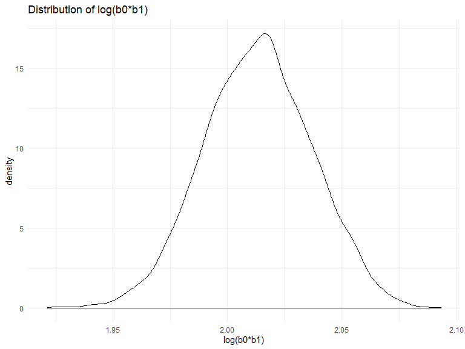

p8105\_hw6\_kpc2124
================
Kristi Chau
11/19/2019


## Problem 1

``` r
bwt = 
  read.csv("./data/birthweight.csv") %>% 
  mutate(
    babysex = as.factor(babysex),
    frace = as.factor(frace),
    frace = ordered(frace),
    malform = as.factor(malform),
    mrace = as.factor(mrace),
    mrace = ordered(mrace)
  )
  ## %>% skimr::skim()
```

Found no missing data after running the `skim` function.

Model 1: I modeled `wtgain` and `smoken` as a linear model with `bwt`
because `bwt` is a continuous variable.

It has been reported that not gaining enough weight during pregnancy is
a risk factor for having a low birthweight baby. Additionally, smoking
during pregnancy can possibly confound the association between gaining
weight during pregnancy and infant birthweight because it is associated
with both weight gain and infant weight, and smoking is unlikely to be a
consequence of weight gain.

``` r
bwt_fit = 
  lm(bwt ~ wtgain + smoken, data = bwt)
```

``` r
bwt_fit %>% 
  broom::tidy() %>% 
  select(term, estimate, p.value) %>% 
  kable(digits = 3, caption = "Modeling the association between infant birthweight and weight gain and number of cigarettes smoked during pregnancy")
```

<table>

<caption>

Modeling the association between infant birthweight and weight gain and
number of cigarettes smoked during pregnancy

</caption>

<thead>

<tr>

<th style="text-align:left;">

term

</th>

<th style="text-align:right;">

estimate

</th>

<th style="text-align:right;">

p.value

</th>

</tr>

</thead>

<tbody>

<tr>

<td style="text-align:left;">

(Intercept)

</td>

<td style="text-align:right;">

2880.220

</td>

<td style="text-align:right;">

0

</td>

</tr>

<tr>

<td style="text-align:left;">

wtgain

</td>

<td style="text-align:right;">

11.675

</td>

<td style="text-align:right;">

0

</td>

</tr>

<tr>

<td style="text-align:left;">

smoken

</td>

<td style="text-align:right;">

\-5.696

</td>

<td style="text-align:right;">

0

</td>

</tr>

</tbody>

</table>

It appears that for every 1 pound mothers gained during pregnancy,
infant birthweight increased by 11.68 grams, after adjusting for number
of cigarettes smoked per day during pregnancy.

For every 1 daily cigarette during pregnancy increase, infant
birthweight dropped by 5.70 lbs.

``` r
bwt %>% 
  modelr::add_residuals(bwt_fit) %>% 
  modelr::add_predictions(bwt_fit) %>% 
  ggplot(aes(x = pred, y = resid)) +
  geom_violin() +
  labs(
    x = "Fitted Values",
    y = "Residuals",
    title = "Model residuals plotted against fitted values"
  )
```


It appears there is significant error around fitted values of 3100.
However, there is also a significant bulk of data around residuals = 0.

Compare to 2 other models:

Model 2: Using length at birth (blength) and gestational age (gaweeks)
as predictors (main effects only)

Model 3: Using head circumference (bhead), length (blength), sex
(babysex), and all interactions (including the three-way interaction)
between these

``` r
cv_df = 
  crossv_mc(bwt, 100) %>% 
  mutate(
    train = map(train, as_tibble),
    test = map(test, as_tibble))

cv_results = 
  cv_df %>% 
  mutate(
    fit1 = map(.x = train,~lm(bwt ~ wtgain + smoken, data = .x)),
    fit2 = map(.x = train,~lm(bwt ~ blength + gaweeks, data = .x)),
    fit3 = map(.x = train,~lm(bwt ~ bhead * blength + bhead * babysex + blength * babysex + bhead * blength * babysex, data = .x)), 
    rmse_fit1 = map2_dbl(.x = fit1, .y = test, ~rmse(.x,.y)),
    rmse_fit2 = map2_dbl(.x = fit2, .y = test, ~rmse(.x,.y)),
    rmse_fit3 = map2_dbl(.x = fit3, .y = test, ~rmse(.x,.y))
  )
```

``` r
cv_results %>% 
  select(starts_with("rmse")) %>% 
  pivot_longer(
    everything(),
    names_to = "model", 
    values_to = "rmse",
    names_prefix = "rmse_") %>% 
  mutate(model = fct_inorder(model)) %>% 
  ggplot(aes(x = model, y = rmse)) + 
  geom_violin() + 
  labs(
    x = "Model",
    y = "Root Mean Squared Errors (RMSEs)",
    title = "Comparison of cross-validated prediction error"
  )
```


We see from this plot that the best fitting model was model 3, which
modeled head circumference (bhead), length (blength), sex (babysex), and
all interactions among these variables. Model 2 (length at birth
(blength) and gestational age (gaweeks) as predictors) had an okay fit,
while my model (mother’s weight gain during pregnancy (wtgain) and
cigarettes smoked during pregnancy (smoken)) was not a good fit and had
a very high prediction error.

## Problem 2

``` r
weather_df = 
  rnoaa::meteo_pull_monitors(
    c("USW00094728"),
    var = c("PRCP", "TMIN", "TMAX"), 
    date_min = "2017-01-01",
    date_max = "2017-12-31") %>%
  mutate(
    name = recode(id, USW00094728 = "CentralPark_NY"),
    tmin = tmin / 10,
    tmax = tmax / 10) %>%
  select(name, id, everything())
```

Use 5000 bootstrap samples and, for each bootstrap sample, produce
estimates of these two quantities (r-squared and log(b0\*b1)).

``` r
r_squared = 
  weather_df %>% 
  modelr::bootstrap(n = 5000) %>% 
  mutate(
    models = map(strap, ~lm(tmax ~ tmin, data = .x)),
    results = map(models, broom::glance),
    ) %>% 
  select(-strap,-models) %>% 
  unnest(results) %>% 
  select(.id,r.squared)

log_b = 
  weather_df %>% 
  modelr::bootstrap(n = 5000) %>% 
  mutate(
    models = map(strap, ~lm(tmax ~ tmin, data = .x)),
    results2 = map(models, broom::tidy),
    ) %>% 
  select(-strap,-models) %>% 
  unnest(results2) %>% 
  select(.id, term, estimate) %>% 
  pivot_wider(
    names_from = term,
    values_from = estimate
  ) %>% 
  mutate(log_b = log(`(Intercept)` * tmin))
```

Plot the distribution of your estimates

``` r
r_squared %>% 
  ggplot(aes(x = r.squared)) +
  geom_density() +
  labs(x = "R^2")
```


It appears that the distribution of the r-squared is somewhat
left-skewed, with a few outliers pulling it toward 0.87 on the left. The
observations peak around 0.9125.

``` r
log_b %>% 
  ggplot(aes(x = log_b)) +
  geom_density()
```



The distribution of the log(beta0\*beta1) appears to be more normally
distributed with a peak around 2.012.

95% confidence intervals

``` r
r_squared %>% 
  pull(r.squared) %>% 
  quantile(probs = c(0.025,0.975),na.rm = TRUE)
```

    ##      2.5%     97.5% 
    ## 0.8936977 0.9274807

The 95% confidence interval of r-squared is (0.8940,0.9271).

``` r
log_b %>% 
  pull(log_b) %>% 
  quantile(probs = c(0.025,0.975),na.rm = TRUE)
```

    ##     2.5%    97.5% 
    ## 1.965633 2.058469

The 95% confidence interval of log(b0 \* b1) is (1.9660,2.0586).
